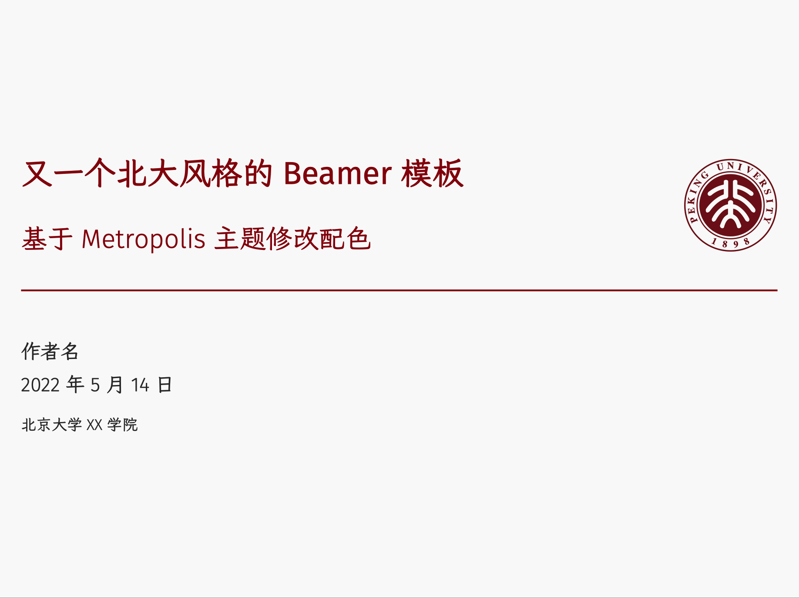
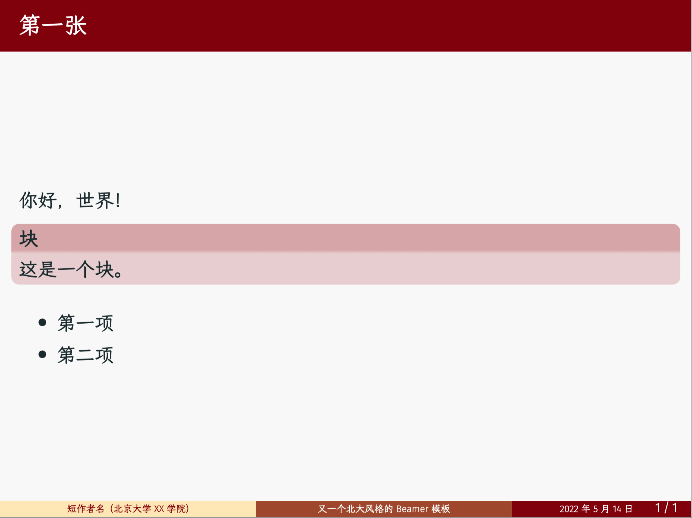
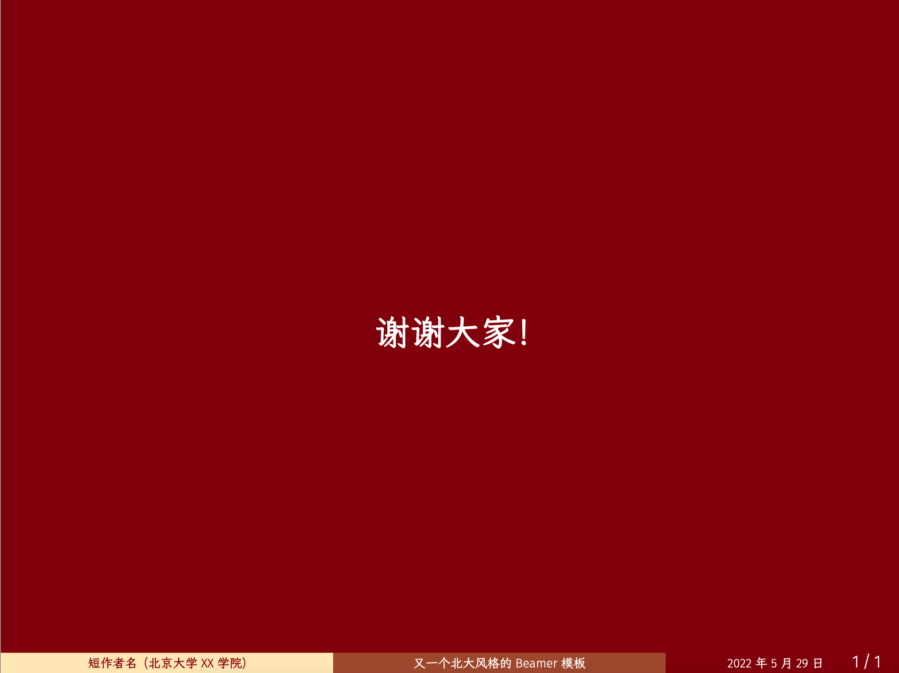

# PKU-Beamer-Theme

又一个北大风格的Beamer模板，根据[metropolis主题](https://github.com/matze/mtheme)修改了配色。

效果图：

修改配色的方法和其他配色参考此[知乎回答](https://www.zhihu.com/question/29676847/answer/2070402882)。

其他北大风格的Beamer模板：
* https://github.com/inFaaa/PKU-Beamer-Theme
* https://github.com/zinccat/PKU-beamer-theme